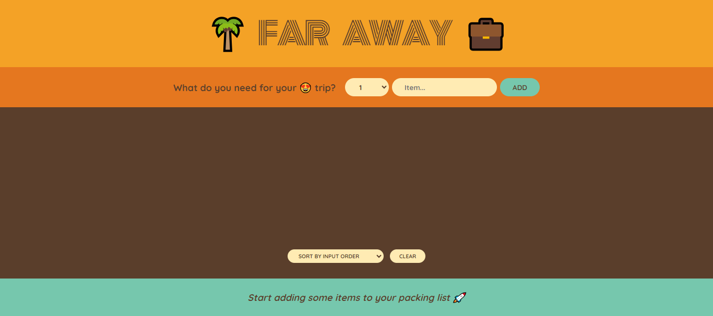

# 🌴 Far Away 💼 - Your Ultimate Packing List App

Welcome to **Far Away**, a comprehensive and easy-to-use packing list application built with **React** ⚛️. Whether you're preparing for a short weekend getaway or a long international vacation, this app helps you organize, manage, and track all the essentials you need to pack. Never forget an item again!

## 📸 Screenshot



- Github Repo: [Github-link](https://github.com/Mikiyas6/The-Far-Away-Travel-List)
- Live Site URL: [Page-link](https://far-away-travel-listtt.netlify.app/)

## 📦 Features

### 📝 Add Items to Your Packing List

Effortlessly add items with a description and quantity to your packing list. Every item you add will be tracked, so you can pack without worrying about missing anything.

### ✅ Mark Items as Packed/Unpacked

Toggle the packing status of each item by checking or unchecking the box next to it. Packed items will appear crossed out, giving you a clear view of what’s already packed and what’s left.

### 🗑️ Delete Individual Items

Change your mind or made a mistake? Simply delete any item with the `❌` button next to it. Organize your list to fit your exact needs.

### 🔄 Sort Items Easily

Sort your items based on:

- **Input Order**: See items in the order you added them.
- **Description**: Organize items alphabetically for quick scanning.
- **Packed Status**: View all packed items together and unpacked items separately.

### 📊 View Packing Progress

Keep track of your progress with detailed statistics:

- The total number of items on your list.
- How many items you’ve already packed.
- The percentage of items packed, helping you stay on top of your preparation.

### 🧹 Clear All Items

Want to start fresh? You can clear all items at once with a simple confirmation step, ensuring you don’t accidentally lose your entire list.

---

## 🛠️ Technologies Used

- **React** ⚛️: The entire UI is built using React, leveraging its state management and component-based architecture.
- **JavaScript**: For handling logic such as adding, deleting, and toggling item statuses.
- **CSS**: Provides the styling that gives this app its clean and modern appearance.
- **useState Hook**: For managing dynamic state like the list of items and sorting preferences.

---

## 🏗️ Project Structure

The project is broken down into modular components to ensure maintainability and scalability.

- **App Component**:
  - The central component that controls the state of the entire app. It includes handlers for adding, deleting, and toggling packed items, as well as clearing the entire list.
- **Form Component**:

  - A form where users can input their item description and quantity. When submitted, it adds the new item to the packing list.

- **PackingList Component**:

  - Displays all the items in the list. Users can sort the items and also clear them all with one click.

- **Item Component**:

  - Each individual item in the list, with functionality to toggle its packed status and delete it from the list.

- **Stats Component**:

  - Displays dynamic statistics based on the current state of the packing list. Shows how many items are packed, unpacked, and the overall percentage.

- **Logo Component**:
  - A simple logo component to give the app a welcoming and friendly look.

---

## 🎨 Design & User Experience

The design philosophy of **Far Away** is to keep things simple yet functional:

- **Minimalist UI**: A clean interface that’s intuitive and easy to navigate.
- **Real-time Feedback**: As soon as you add or update an item, the app immediately reflects the changes.
- **Responsive**: The app is responsive across different device sizes, ensuring you can use it whether you're on mobile, tablet, or desktop.
- **Interactive Sorting and Feedback**: Quickly sort and manage your packing list to suit your personal style and preferences.

---

## 🚀 Getting Started

### Installation Instructions

1. Clone this repository:
   ```bash
   git clone https://github.com/Mikiyas6/The-Far-Away-Travel-List
   ```
1. Install dependencies:
   ```bash
   npm install
   ```
1. Start the project:
   ```bash
   npm start
   ```

## 🛠 Usage Instructions

- **Add an Item**: Start typing the name of the item you want to add (e.g., "Sunglasses") and choose the quantity (e.g., 2). Press the "Add" button to add it to the list.

- **Mark as Packed**: When you pack an item, check the box next to it. The item will be crossed off, indicating it's packed.

- **Delete an Item**: If you don't need an item anymore, click the `❌` button next to it to remove it from the list.

- **Sort Items**: Use the dropdown menu to sort your items based on input order, description, or packed status.

- **Clear the List**: Once you're done or want to start fresh, press "Clear" to remove all items from the list. A confirmation prompt will appear to prevent accidental deletion.

## 📊 Statistics

The app dynamically calculates and displays statistics based on your packing progress:

- **Total Items**: The number of items you've added to the list.
- **Packed Items**: The number of items you’ve packed.
- **Percentage Packed**: The percentage of items packed, giving you a quick overview of your progress.

## 🤝 Contributing

We welcome contributions from everyone. If you'd like to add new features, fix bugs, or improve the design, feel free to:

1. Fork the repository.
2. Create a new branch.
3. Make your changes and commit them.
4. Submit a pull request with a description of your changes.

## 🧑‍💻 Author

Created by **`Mikiyas Teowodroes`**. Feel free to reach out if you have any questions or suggestions!

## 🌟 Acknowledgements

Thanks to the React community for creating an amazing framework that powers this app. Also, thanks to the many users who’ve provided feedback to improve the app.
